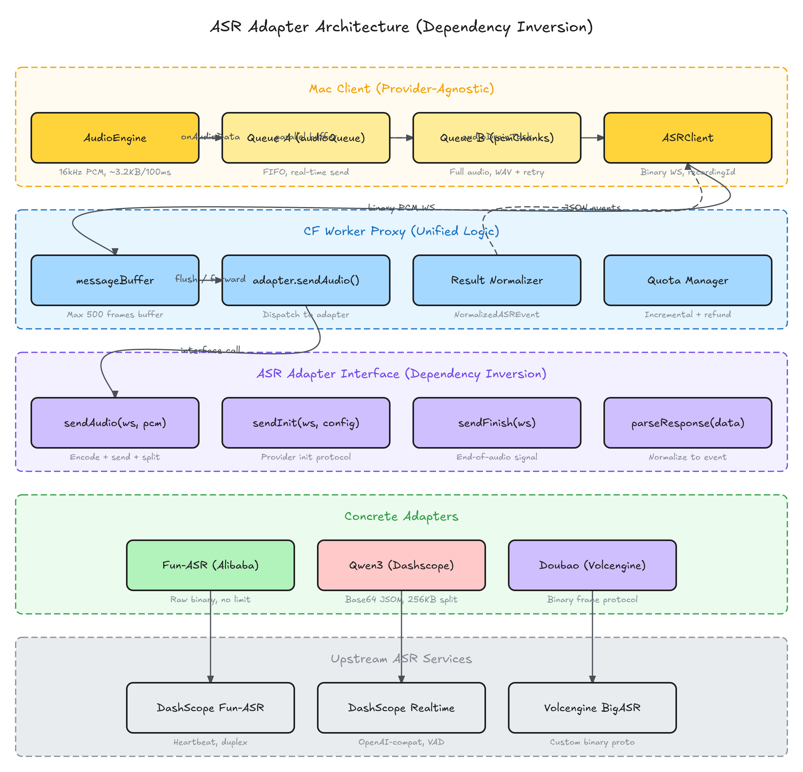
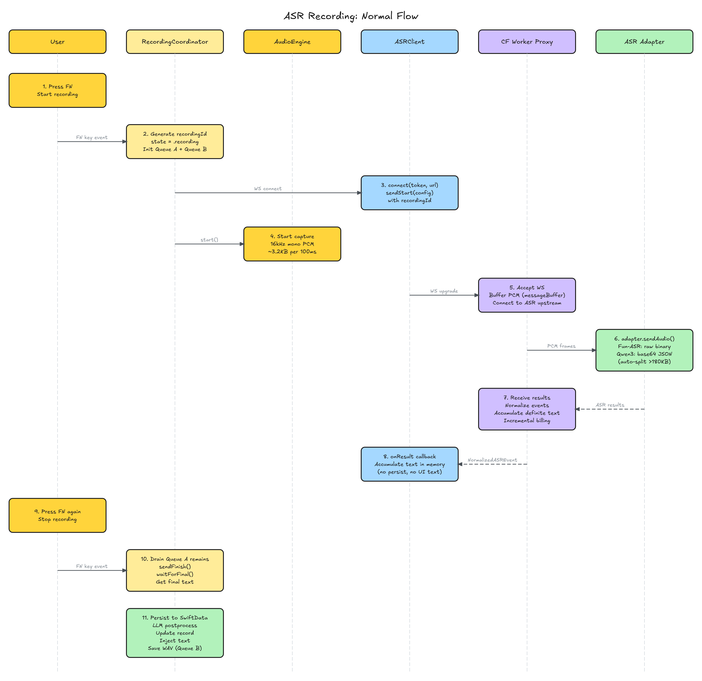
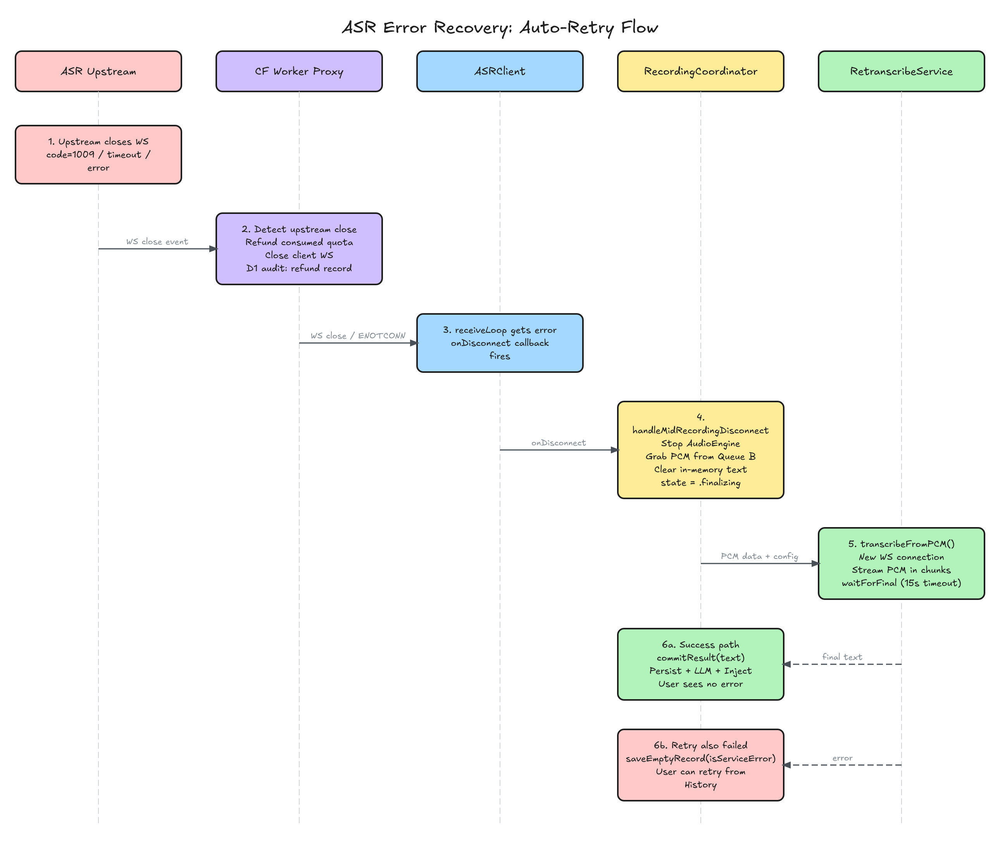

# ASR 录音转写架构

## 设计原则

1. **音频数据是 source of truth** — 一旦采集不能丢，Queue B 保留全量 PCM 用于 WAV 保存和断链重试
2. **每段录音是独立实体** — 按下 FN 即生成 `recordingId` (UUID)，贯穿整个链路
3. **处理是幂等的** — 同一段音频重新处理结果不变，重试不产生副作用
4. **客户端 provider 无关** — 只发 binary PCM，不关心后端用哪个 ASR 服务
5. **依赖倒置** — Proxy 通过 adapter 接口调用，切换 ASR 服务只需新增 adapter + 改环境变量

---

## 架构总览



### 四层架构

| 层 | 职责 | 是否统一 |
|---|---|---|
| **Mac Client** | 采集音频 → Queue A (FIFO 实时发送) + Queue B (WAV/重试) → binary PCM WS | 统一 |
| **CF Worker Proxy** | 缓冲 → adapter 分发 → 结果归一化 → 配额计量/退还 | 统一 |
| **ASR Adapter** | sendAudio / sendInit / sendFinish / parseResponse — 各 provider 自行处理编码、分片、协议 | 定制 |
| **Upstream ASR** | 各家 ASR 服务 (Alibaba / Volcengine) | 外部 |

---

## 正常录音流程



### 1. 按下 FN — 开始录音

```
RecordingCoordinator:
  ├─ recordingId = UUID()
  ├─ state = .recording
  ├─ ASRClient.connect(token, url) + sendStart(config with recordingId)
  └─ AudioEngine.start()
       ├─ Queue A: onAudioData → audioQueue.append(chunk ~3.2KB)
       └─ Queue B: pcmChunks.append(chunk)  // 全量缓存，给 WAV 和重试用
```

### 2. 录音中 — 实时数据流

```
正向（音频，~100ms 间隔）:
  AudioEngine → Queue A → audioDrainTask → ASRClient.sendAudio(binary)
    → CF Worker Proxy messageBuffer → adapter.sendAudio(ws, pcm)
    → ASR upstream

反向（结果）:
  ASR upstream → adapter.parseResponse → Proxy 归一化
    → NormalizedASREvent → ASRClient.onResult
    → RecordingCoordinator 内存累积 liveText（不落盘、不展示文本）
    → 气泡仅显示录音状态（能量条）
```

**Proxy 增量计费**：每收到一个 definitive segment，消费对应字符数（防刷）。每 30 秒消费时长。

### 3. 按下 FN — 停止录音

```
RecordingCoordinator:
  ├─ audioDrainTask.cancel()
  ├─ AudioEngine.stop()
  ├─ Drain Queue A 剩余未发送的小块
  ├─ ASRClient.sendFinish()
  ├─ waitForFinal(timeout: 8s) → 获取最终文本
  ├─ 第一次落盘: SwiftData TranscribeRecord（带 recordingId）
  ├─ LLM postprocess → update record
  ├─ InputWriter.write(finalText) → 注入到当前焦点应用
  └─ Queue B → drainBuffer() → WAV 文件保存
```

---

## 异常恢复流程



### ASR 上游断链 → 自动重试

```
ASR upstream 断链 (code=1009 / timeout / error)
  → CF Worker Proxy:
      检测 upstream close
      if (!receivedAsrFinal && !clientCloseInitiated):
        退还已消费用量（chars + duration）
        D1 审计记录
      关闭 client WS

  → ASRClient:
      receiveLoop 收到 .failure
      触发 onDisconnect 回调

  → RecordingCoordinator.handleMidRecordingDisconnect():
      retryCount < maxAutoRetries (1)?
        是 →
          停止 AudioEngine
          从 Queue B 获取全部 PCM
          清空内存文本
          state = .finalizing（气泡显示加载中）
          调用 RetranscribeService.transcribeFromPCM()
            → 新 WS 连接 → 流式发送 PCM → 获取结果
          成功 → commitResult() → 落盘 + 后处理 + 注入（用户无感知）
          失败 → saveEmptyRecord(isServiceError) → 用户可从 History 手动重试
        否 →
          保存为 service error
```

### 计费处理

| 场景 | 处理 |
|------|------|
| 正常完成 (`receivedAsrFinal = true`) | 保留用量 |
| 上游断链 (`!receivedAsrFinal && !clientCloseInitiated`) | **退还**已消费用量 |
| 客户端强关 (`clientCloseInitiated = true`) | 保留用量（防刷） |
| CF Worker 自身崩溃 | 无法退还（极低频，接受少量误差） |

自动重试时，新 session 从零开始计费，不会重复扣费。

---

## ASR Adapter 接口

```typescript
interface ASRProviderAdapter {
  name: string                          // 日志标识
  accumulatesResults: boolean           // result 是否已累积
  minAudioFlowBeforeFinishMs?: number   // finish 前最少音频流动时间

  createConnection(env): WebSocket | Promise<WebSocket>
  sendInit(ws, config): void            // 发送初始化消息
  sendAudio(ws, pcm: ArrayBuffer): void // 发送音频（含编码+分片）
  sendFinish(ws): void                  // 发送结束信号
  parseResponse(data): NormalizedASREvent | null  // 解析为统一格式
  isReady(event): boolean               // 是否可以开始发送音频
  isFinished(event): boolean            // 是否会话结束
}
```

### 各 Adapter 的 sendAudio 实现

| Adapter | 协议 | sendAudio 行为 | 帧限制 |
|---------|------|---------------|--------|
| **Fun-ASR** | DashScope duplex WS | `ws.send(pcm)` raw binary | 无 |
| **Qwen3** | OpenAI Realtime-compat | base64 JSON text frame，>180KB 自动分片 | 256KB |
| **Doubao** | Volcengine binary proto | 自定义二进制头 + PCM payload | 无 |

### 新增 ASR 服务的步骤

1. 在 `apps/services/src/asr/` 新建 adapter 文件，实现 `ASRProviderAdapter`
2. 在 `adapter-factory.ts` 注册 model 前缀匹配
3. 设置 `ASR_MODEL` 环境变量，部署

---

## 音频传输与 VAD

Qwen3 使用 server-side VAD（`silence_duration_ms=400`），依赖**投递时序**检测语音停顿：

| 传输方式 | 投递速度 | VAD 切分 | 标点质量 |
|---------|---------|---------|---------|
| 正常实时录音 | 1× 实时（100ms/帧） | 正常多段 | 准确 |
| Proxy buffer flush | 瞬间（连接就绪前的缓存） | 可能合并为单段 | 略差 |
| 断链重试 | ~10× 实时（10ms/帧） | 合并为单段 | 略差 |

正常录音路径下 VAD 工作正常。异常重试路径因为 burst 投递会导致 VAD 不切分，整段作为一个长句处理，标点可能不如实时准确。这是速度和质量的合理 tradeoff。

---

## 关键文件索引

### Mac Client (`apps/mac-desktop/Xisper/`)

| 文件 | 职责 |
|------|------|
| `Services/RecordingCoordinator.swift` | 状态机：idle → recording → finalizing → committing → idle。管理 Queue A/B、断链重试 |
| `Services/ASRClient.swift` | WebSocket 客户端。onReady / onResult / onDisconnect 回调 |
| `Services/AudioEngine.swift` | AVAudioEngine 采集，16kHz mono PCM，100ms 回调间隔 |
| `Services/RetranscribeService.swift` | 重试/重转写。`transcribeFromPCM()` 可复用方法 |
| `Models/TranscribeRecord.swift` | SwiftData 模型，recordingId 为主键 |

### Backend (`apps/services/src/`)

| 文件 | 职责 |
|------|------|
| `routes/asr-proxy.ts` | WS proxy：缓冲 → adapter 分发 → 归一化 → 计费 → 退还 |
| `asr/types.ts` | `ASRProviderAdapter` 接口定义 |
| `asr/qwen3-asr-adapter.ts` | Qwen3 adapter：base64 JSON + 180KB 分片 |
| `asr/alibaba-adapter.ts` | Fun-ASR adapter：raw binary 透传 |
| `asr/doubao-adapter.ts` | Doubao adapter：自定义二进制协议 |
| `asr/adapter-factory.ts` | 根据 `ASR_MODEL` 创建对应 adapter |
| `utils/rate-limiter.ts` | 配额消费 + 退还（D1 优先，KV 回退） |

---

## 环境配置

| 环境 | ASR_MODEL | Base URL |
|------|-----------|----------|
| Production | `qwen3-asr-flash-realtime` | `xisper.hawkeye-xb.com` |
| Beta/Dev | 默认 `fun-asr-flash-8k-realtime` | `xisper-dev.hawkeye-xb.com` |

切换 ASR 服务只需修改 `wrangler.toml` 中的 `ASR_MODEL` 并部署。
