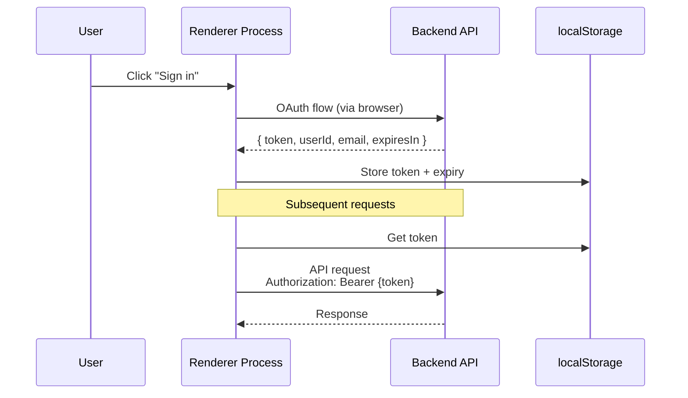

# Environment Configuration Guide

This document describes how different environments are configured and how to build packages for each environment.

## Environments

The project supports three environments:

### 1. Development (Local)
- **API URL**: `http://localhost:8787`
- **WebSocket URL**: `ws://localhost:8787`
- **Database**: Beta Cloudflare DB
- **Usage**: Local development and testing

### 2. Beta
- **API URL**: `https://xisper-dev.hawkeye-xb.com`
- **WebSocket URL**: `wss://xisper-dev.hawkeye-xb.com`
- **Database**: Beta Cloudflare DB
- **Usage**: Beta testing and pre-production verification

### 3. Production
- **API URL**: `https://xisper.hawkeye-xb.com`
- **WebSocket URL**: `wss://xisper.hawkeye-xb.com`
- **Database**: Production Cloudflare DB (to be configured)
- **Usage**: Production release

## Building Desktop Packages

### Beta Package
```bash
# Build Beta package (no publishing)
pnpm run pkg:desktop:mac:beta

# Build and publish Beta package
pnpm run pub:desktop:mac:beta
```

### Production Package
```bash
# Build Production package (no publishing)
pnpm run pkg:desktop:mac:prod

# Build and publish Production package
pnpm run pub:desktop:mac:prod
```

## How It Works

### Environment Detection
The environment is determined by Vite's `MODE` at build time:
- Development: `vite dev` (MODE=development)
- Beta: `vite build --mode beta` (MODE=beta)
- Production: `vite build --mode production` (MODE=production)

### Configuration Files
- **`apps/web/src/config/env.ts`**: Centralized environment configuration
  - Contains all environment-specific URLs
  - Provides helper functions to get current environment settings

### Modified Files
The following files have been updated to use the centralized environment configuration:
1. `apps/web/src/utils/api-client.ts` - API client interceptor
2. `apps/web/src/composables/use-auth.ts` - Authentication utilities
3. `apps/web/src/config/recording-config.ts` - WebSocket configuration
4. `apps/web/src/views/AuthSetup.vue` - OAuth code exchange
5. `apps/web/src/stores/llm-postprocess.ts` - LLM service configuration

## Testing

### Test Development Environment
```bash
# Start local development server
cd apps/services
wrangler dev

# Start web app
cd apps/web
pnpm run dev

# Should connect to http://localhost:8787
```

### Test Beta Environment
```bash
# Build Beta package
pnpm run pkg:desktop:mac:beta

# Install and test the built package
# Should connect to https://xisper-dev.hawkeye-xb.com
```

## Deployment

### Services Deployment
```bash
# Deploy to Beta
cd apps/services
pnpm run deploy:beta

# Deploy to Production (when ready)
pnpm run deploy:production
```

### Client Deployment

#### Manual Build
```bash
# Beta package
pnpm run pkg:desktop:mac:beta

# Production package
pnpm run pkg:desktop:mac:prod
```

#### Automated Build (GitHub Actions)
Push a tag to trigger the build workflow:

```bash
# Beta release
git tag desktop-v1.0.0-beta
git push origin desktop-v1.0.0-beta

# Production release
git tag desktop-v1.0.0
git push origin desktop-v1.0.0
```

**Tag Format**:
- Beta: `desktop-v*.*.*-beta` (e.g., `desktop-v1.0.0-beta`)
- Production: `desktop-v*.*.*` (e.g., `desktop-v1.0.0`)

**What happens**:
1. Beta tag → builds with `pkg:desktop:mac:beta` → connects to Beta service
2. Production tag → builds with `pkg:desktop:mac:prod` → connects to Production service
3. Uploads to GitHub Releases and Cloudflare R2

## Desktop Release & Auto-Update SOP

### Overview

The release flow is designed with a **manual verification gate**: CI builds and uploads to R2, but auto-update is NOT triggered until you explicitly enable it via KV config. This ensures every release is tested before reaching users.

### Architecture

```
CI Build → Upload to R2 (dmg/zip/yml) → KV enabled=false (no update pushed)
                                              ↓
                                   Manual download & verify
                                              ↓
                               cf-toggle-update.sh → KV enabled=true
                                              ↓
                         Client checks API → Backend reads R2 manifest → Push update
```

### Step-by-Step Release Process

#### 1. Trigger CI Build

Push a version tag to trigger GitHub Actions:

```bash
# Beta release
git tag desktop-v0.1.8-beta
git push origin desktop-v0.1.8-beta

# Production release
git tag desktop-v0.1.8
git push origin desktop-v0.1.8
```

CI will: build → sign → notarize → upload to GitHub Releases + Cloudflare R2.

#### 2. Verify Build Artifacts

After CI completes, download and test the build from R2:

```bash
# R2 public base URL
# https://pub-8d0b4c0438504982bd50075e051cceb1.r2.dev

# Beta DMG download
open "https://pub-8d0b4c0438504982bd50075e051cceb1.r2.dev/beta/Xisper-0.1.8-beta-arm64.dmg"

# Check manifest content
curl "https://pub-8d0b4c0438504982bd50075e051cceb1.r2.dev/beta/latest-mac.yml"
```

Verification checklist:
- App launches correctly
- Core features work as expected
- No crash or critical bugs

#### 3. Enable Auto-Update

After verification passes, enable auto-update via KV toggle:

```bash
cd apps/services

# Enable beta channel (non-mandatory, users can choose to update)
./scripts/cf-toggle-update.sh beta true false

# Enable beta channel (mandatory, force all users to update)
./scripts/cf-toggle-update.sh beta true true

# For production channel
./scripts/cf-toggle-update.sh production true false
```

#### 4. Verify Update API

Confirm the update API returns the manifest correctly:

```bash
# Beta
curl "https://xisper-dev.hawkeye-xb.com/api/app/updates/manifest?channel=beta&platform=darwin&currentVersion=0.0.1-beta"

# Production
curl "https://xisper.hawkeye-xb.com/api/app/updates/manifest?channel=production&platform=darwin&currentVersion=0.0.1"
```

- **200 + YAML body** = update available, file URLs should be absolute R2 URLs
- **204 No Content** = no update (either disabled or client already on latest)

#### 5. (Optional) Disable Auto-Update

After rollout is complete or if issues are found:

```bash
# Disable beta updates (emergency stop)
./scripts/cf-toggle-update.sh beta false

# Disable production updates
./scripts/cf-toggle-update.sh production false
```

### Quick Reference

| Action | Command |
|--------|---------|
| Trigger beta build | `git tag desktop-v*.*.*-beta && git push origin --tags` |
| Trigger prod build | `git tag desktop-v*.*.* && git push origin --tags` |
| Download beta DMG | `https://pub-8d0b4c0438504982bd50075e051cceb1.r2.dev/beta/{filename}.dmg` |
| Check manifest | `curl https://pub-8d0b4c0438504982bd50075e051cceb1.r2.dev/beta/latest-mac.yml` |
| Enable update | `./scripts/cf-toggle-update.sh beta true false` |
| Force update | `./scripts/cf-toggle-update.sh beta true true` |
| Disable update | `./scripts/cf-toggle-update.sh beta false` |
| View KV config | `wrangler kv key get --binding=APP_UPDATE_CONFIG --preview false "update_config:beta"` |

### Environment Variables (Required)

The backend Worker needs `R2_PUBLIC_URL` set correctly for file URL rewriting:

```
R2_PUBLIC_URL=https://pub-8d0b4c0438504982bd50075e051cceb1.r2.dev
```

Set via `wrangler secret put R2_PUBLIC_URL` or in `.dev.vars` for local development.

## Troubleshooting

### Check Current Environment
Add logging in your code:
```typescript
import { getCurrentEnvironment, getEnvConfig } from '@/config/env'

console.log('Current environment:', getCurrentEnvironment())
console.log('Config:', getEnvConfig())
```

### Common Issues
1. **Wrong API URL**: Check that you're using the correct build command for your target environment
2. **WebSocket Connection Failed**: Ensure the Beta service is deployed and accessible
3. **Authentication Failed**: Check localStorage for valid token and expiry time
4. **Token expired**: Token is stored in localStorage with expiry time, clear it and re-login

## Authentication Architecture

### Token-Based Authentication

**Current Setup**:
- Backend returns JWT token in response body (not via Cookie)
- Frontend stores token in `localStorage`
- API requests use `Authorization: Bearer {token}` header
- **Location**: 
  - Backend: `apps/services/src/routes/auth.ts` (exchange-token endpoint)
  - Frontend: `apps/web/src/utils/api-client.ts` (global fetch interceptor)

**Authentication Flow**:



**Why this approach**:
- Electron loads frontend from `file://` protocol
- `file://` to `https://` Cookie mechanism is unreliable across browsers
- Bearer Token authentication is simpler and more reliable for desktop apps
- localStorage in Electron has similar security as httpOnly Cookie (both accessible via DevTools)

**Security considerations**:
- Token stored in localStorage (visible in DevTools, acceptable for desktop apps)
- No third-party content loaded (XSS attack surface minimized)
- Input validation and output encoding prevent injection attacks
- Token expiry enforced both client-side and server-side

**Token Storage**:
- `auth_token`: JWT token from Logto
- `token_expires_at`: Expiry timestamp (milliseconds)

**Migration from Cookie**:
- Backend supports both Authorization header (new) and Cookie (legacy)
- Frontend now uses Authorization header exclusively
- Old Cookie-based clients will continue to work during transition
